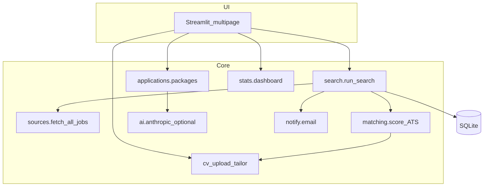

# Architecture

```mermaid
flowchart TB
  subgraph ui [UI]
    Streamlit[Streamlit_multipage]
  end
  subgraph core [Core]
    Search[search.run_search]
    Sources[sources.fetch_all_jobs]
    Match[matching.score_ATS]
    CV[cv_upload_tailor]
    Apps[applications.packages]
    AI[ai.anthropic_optional]
    Notify[notify.email]
    Stats[stats.dashboard]
  end
  DB[(SQLite)]
  Streamlit --> Search
  Streamlit --> CV
  Streamlit --> Apps
  Streamlit --> Stats
  Search --> Sources
  Search --> Match
  Search --> DB
  Match --> CV
  Apps --> AI
  Search --> Notify
```

Core packages are UI-agnostic for a future web/PWA frontend.
